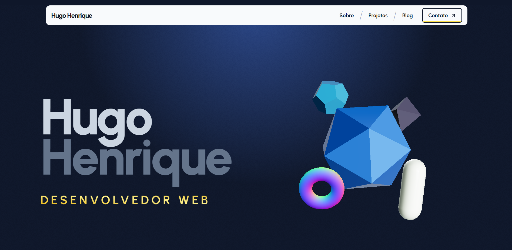

# Portfolio Pessoal

Este é o repositório do meu portfolio pessoal, que demonstra minhas habilidades em desenvolvimento web usando Next.js, Prismic, Tailwind CSS e GSAP.

## Visão Geral
Este projeto é um exemplo do meu trabalho em desenvolvimento web. Ele inclui uma integração com Prismic para gerenciamento de conteúdo, utiliza o framework Next.js para renderização do lado do servidor, estilização com Tailwind CSS e animações com GSAP.

## Recursos

- **Next.js**: Utilizado para renderização do lado do servidor e roteamento dinâmico.
- **Prismic**: Integrado para gerenciamento de conteúdo, permitindo uma fácil edição e publicação de conteúdo.
- **Tailwind CSS**: Framework de CSS utilizado para estilização responsiva e rápida prototipagem.
- **GSAP**: Biblioteca de animação JavaScript utilizada para criar animações suaves e interativas.

## Estrutura de Diretórios

- `/components`: Componentes reutilizáveis.
- `/public`: Arquivos estáticos, como imagens e fontes.
- `/styles`: Estilos globais e configurações do Tailwind CSS.
- `/utils`: Utilitários e funções auxiliares.
- `/slices`: Configuração e utilitários relacionados ao Prismic.